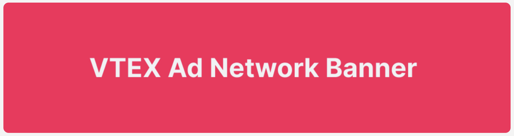

📢 Use this project, [contribute](https://github.com/{OrganizationName}/{AppName}) to it or open issues to help evolve it using [Store Discussion](https://github.com/vtex-apps/store-discussion).

# Sponsored Banners

<!-- DOCS-IGNORE:start -->
<!-- ALL-CONTRIBUTORS-BADGE:START - Do not remove or modify this section -->

[](#contributors-)

<!-- ALL-CONTRIBUTORS-BADGE:END -->
<!-- DOCS-IGNORE:end -->

VTEX Sponsored Banners is responsible for implementing the necessary frontend apps to properly render the sponsored banner.

This component will request the sponsored banners available for publisher that's implementing it and render it on screen. This component already add the Analytics data.



## Configuration

### Step 1: Adding the Sponsored Products app to your theme's dependency

In your theme's `manifest.json`, add the Sponsored Banners app as a dependency:

```json
  "dependencies": {
    "vtex.sponsored-banners": "0.x"
  }
```

Now, you are able to use all the blocks exported by the `sponsored-banners` app. Check out the full list below:

#### `sponsored-banners` blocks

| Block name          | Description                                                                                                                                                                                              |
| ------------------- | -------------------------------------------------------------------------------------------------------------------------------------------------------------------------------------------------------- |
| `sponsored-banners` | Renders the Banner on Screen. You can customize its CSS however fits best your store. Already contains analytics data to observe impression and click metrics to assess the performance of the campaigns |

### Step 2: Using the Sponsored Banners blocks

#### The sponsored banner

This is fairly straightforward: simply call it as a child block on your Home. For example:

```diff
"disposition-layout#home": {
    "children": [
        "flex-layout.row#component-options-home",
        "flex-layout.row#component-benefits-home",
+       "sponsored-banners",
        "flex-layout.row#home-tab-layout-shelf-01",
        "flex-layout.row#component-shelfbanner-home-02",
    ]
},
```

## Blocks

### `sponsored-banners`

| Prop name | Type     | Description        | Default value                |
| --------- | -------- | ------------------ | ---------------------------- |
| `adUnit`  | `string` | Banner dimensions. | `billboard` or `970 x 250px` |

## Customization

In order to apply CSS customizations in this and other blocks, follow the instructions given in the recipe on [Using CSS Handles for store customization](https://vtex.io/docs/recipes/style/using-css-handles-for-store-customization).

| CSS Handles     |
| --------------- |
| `bannerWrapper` |
| `bannerImage`   |

<!-- DOCS-IGNORE:start -->

## Contributors ✨

Thanks goes to these wonderful people:

<!-- ALL-CONTRIBUTORS-LIST:START - Do not remove or modify this section -->
<!-- prettier-ignore-start -->
<!-- markdownlint-disable -->
<!-- markdownlint-enable -->
<!-- prettier-ignore-end -->

<!-- ALL-CONTRIBUTORS-LIST:END -->

This project follows the [all-contributors](https://github.com/all-contributors/all-contributors) specification. Contributions of any kind are welcome!

<!-- DOCS-IGNORE:end -->

---

Check out some documentation models that are already live:

- [Breadcrumb](https://github.com/vtex-apps/breadcrumb)
- [Image](https://vtex.io/docs/components/general/vtex.store-components/image)
- [Condition Layout](https://vtex.io/docs/components/all/vtex.condition-layout@1.1.6/)
- [Add To Cart Button](https://vtex.io/docs/components/content-blocks/vtex.add-to-cart-button@0.9.0/)
- [Store Form](https://vtex.io/docs/components/all/vtex.store-form@0.3.4/)
